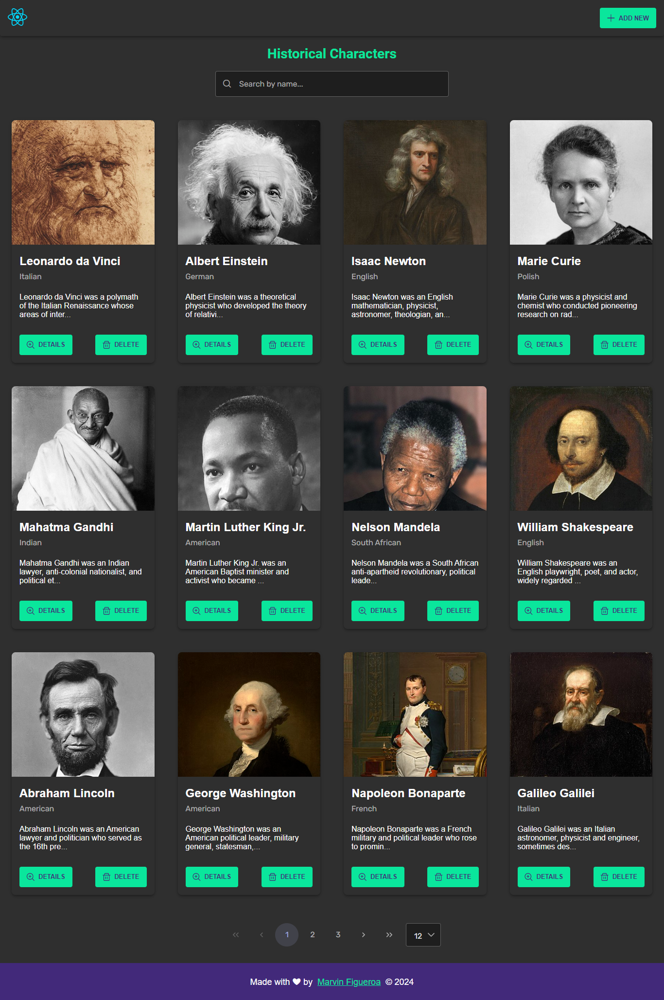
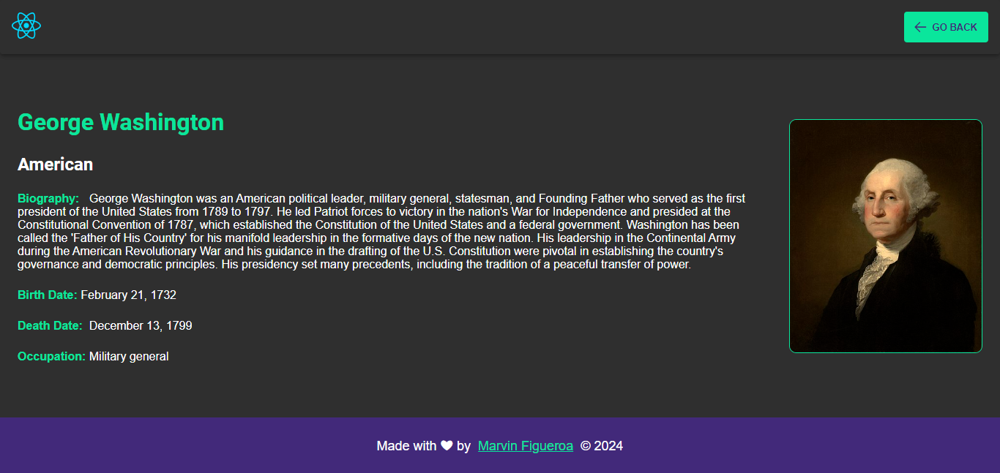
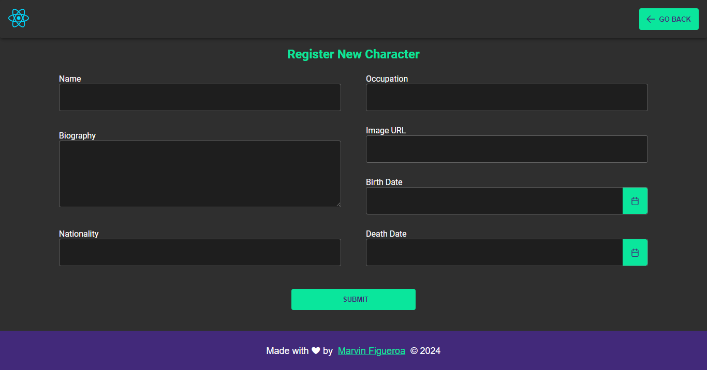

# Frontend Challenge - Historical Characters

Desarrollar una aplicación web que permita gestionar información sobre personajes históricos. Utilizar React como librería base y Zustand para el manejo de estado.

## Tabla de contenidos

- [El desafio](#el-desafio)
- [Capturas](#capturas)
- [Despliegue](#despliegue)
- [Tecnologias utilizadas](#tecnologias-utilizadas)

## El desafio

La aplicacion debe permitir lo siguiente:

- Obtiener todos los personajes.
- Obtiener un personaje por ID.
- Obtiener personajes por nombre (búsqueda parcial).
- Agregar un nuevo personaje.
- Mostrar una lista paginada de personajes con botón para agregar uno nuevo.
- Incluye un campo de búsqueda para filtrar por nombre.
- Al hacer clic en "Agregar", se muestra un formulario vacío con validaciones.
- Guardar el nuevo personaje y regresar a la lista paginada.
- La información de los personajes se almacena en el estado de la aplicación (sin backend) ya sea internamente con variables o con un mockserver.
- Implementación de rutas y navegación entre páginas.
- Página de error 404 para rutas no encontradas.
- Uso de un mockserver (json-server) para simular llamadas HTTP
- Estilizar la aplicación con CSS o una librería de estilos como primereact o TaildwindCSS.
- La aplicación puede ampliarse para incluir más funcionalidades, como la edición de personajes, la eliminación de personajes, etc.

## Capturas

### Vista Inicial

### Vista Detalles

### Vista Formulario Nuevo

## Despliegue

- Web App: [Desplegada en Vercel](https://personajes-historicos-app.vercel.app/)

## Tecnologias utilizadas

- Vite
- React
- TypeScript
- Custom Hooks
- Axios
- React Hook Form
- Zustand
- React Router
- PrimeReact
- Json Server
- React Query
- Zod
